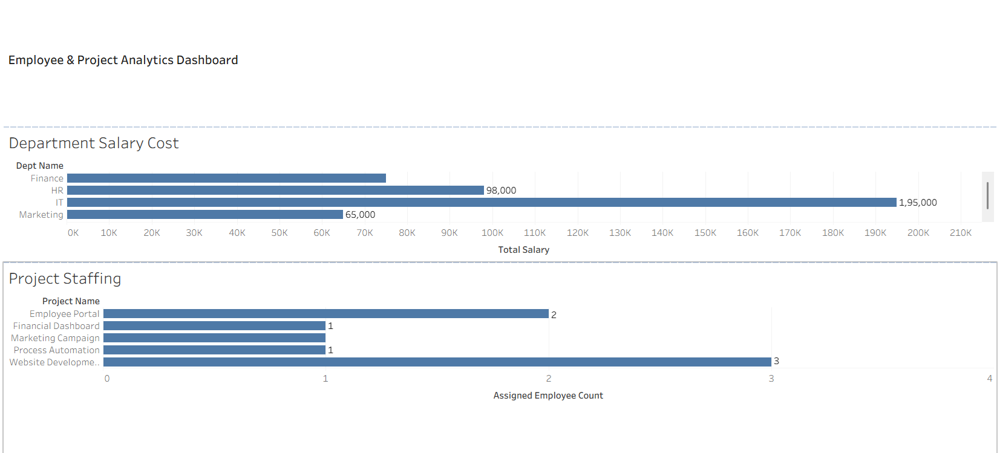

# Employee & Project Analytics | SQL Portfolio Project

## Overview

This SQL project analyzes employee, department, and project-assignment data. It demonstrates practical data-analysis skills using joins, aggregates, subqueries, CTEs, and window functions.

## Database Tables

- `departments` — department names and IDs
- `employees` — employee details, department, and salary
- `projects` — project details
- `employee_projects` — employee-to-project assignments

## Key Questions Answered

- Which departments have the highest employee count and salary cost?
- Which projects have the most employees assigned?
- Which employees earn above their department average salary?
- Which department has the highest total salary?
- Who is the highest-paid employee in each department?
- Which employees are not assigned to a project?

## SQL Skills Demonstrated

- `INNER JOIN` and `LEFT JOIN`
- `COUNT()`, `SUM()`, and `AVG()`
- `GROUP BY` and `ORDER BY`
- Subqueries and correlated subqueries
- Common Table Expressions (CTEs)
- `DENSE_RANK()` window functions

## Project Files

- `sql/portfolio_queries.sql` — seven portfolio SQL analysis queries
- `department.csv` — details of department table that created 
- `employees.csv` — employee assignments
- `employeeprojects.csv` - project insights and details
- `projects.csv` - projects by employees

## Tools Used

- MySQL Workbench
- MySQL
- Tableau (dashboard)

## Resume Description

Built an SQL employee and project analytics project using joins, aggregations, correlated subqueries, CTEs, and window functions to analyze departmental salary costs, workforce allocation, and project staffing.

## Tableau Dashboard

## Dashboard

